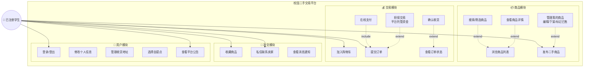

# 已注册学生用例图

## 渲染方式

运行以下命令生成高清 PNG 图片，直接插入论文：

```bash
mmdc -i thesis/已注册学生用例图.md -o thesis/已注册学生用例图.png -w 1200 --backgroundColor white
```

## Mermaid 代码（结构清晰，线条不会乱）



## 用例说明表

### 商品模块

| 用例 | 描述 | 前置条件 |
|------|------|----------|
| 浏览商品列表 | 查看平台所有在售二手商品 | 无 |
| 搜索/筛选商品 | 按关键词、分类、价格区间筛选 | 无 |
| 查看商品详情 | 查看商品图片、描述、价格、卖家信息 | 无 |
| 发布二手商品 | 上传图片、填写描述/价格/分类 | 已登录 |
| 管理我的商品 | 编辑信息、下架商品、标记已售出 | 已登录，为商品发布者 |

### 交易模块

| 用例 | 描述 | 前置条件 |
|------|------|----------|
| 加入购物车 | 将商品添加到购物车暂存 | 已登录 |
| 提交订单 | 选择商品、确认数量/地址后下单 | 已登录，商品未售出 |
| 在线支付 | 通过平台完成支付 | 订单已提交 |
| 查看订单状态 | 查看待付款/待发货/待收货/已完成 | 已登录 |
| 确认收货 | 收到商品后确认，平台放款给卖家 | 已登录，订单为待收货 |
| 担保交易 | 资金由平台托管，收货后放款 | 订单已提交 |

### 社交模块

| 用例 | 描述 | 前置条件 |
|------|------|----------|
| 收藏商品 | 将感兴趣的商品加入收藏夹 | 已登录 |
| 私信联系卖家 | 与卖家在线聊天沟通 | 已登录 |
| 查看消息通知 | 接收系统通知和私信提醒 | 已登录 |

### 用户模块

| 用例 | 描述 | 前置条件 |
|------|------|----------|
| 登录/登出 | 使用学号+密码登录系统 | 已注册 |
| 修改个人信息 | 修改昵称、头像、联系方式 | 已登录 |
| 管理收货地址 | 添加/编辑/删除收货地址 | 已登录 |
| 选择自提点 | 选择校内自提点当面交易 | 已登录 |
| 查看平台公告 | 阅读平台发布的通知公告 | 无 |

## 与未注册学生的对比

| 功能 | 未注册 | 已注册 |
|------|:---:|:---:|
| 浏览/搜索商品 | ✅ | ✅ |
| 发布商品 | ❌ | ✅ |
| 下单购买 | ❌ | ✅ |
| 收藏商品 | ❌ | ✅ |
| 私信聊天 | ❌ | ✅ |
| 担保交易 | ❌ | ✅ |
| 订单管理 | ❌ | ✅ |
| 个人信息管理 | ❌ | ✅ |
