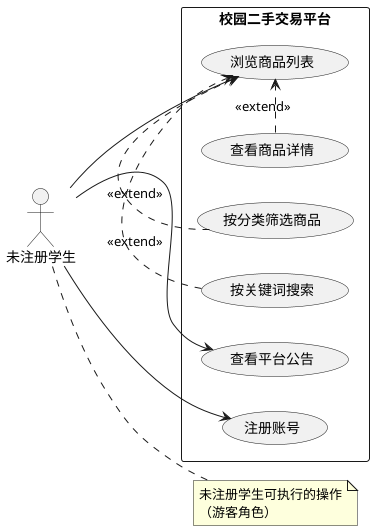

# 未注册学生用例图

## 方式一：PlantUML（推荐，论文级标准 UML）

在线渲染：https://www.plantuml.com/plantuml/uml/ 直接粘贴即可



## 方式二：draw.io 手动绘制

导入下面 XML 到 draw.io 即可直接看到用例图：
（保存为 `.drawio` 文件后在 draw.io 中打开）

```xml
<mxfile host="app.diagrams.net">
  <diagram name="未注册学生用例图">
    <mxGraphModel>
      <root>
        <mxCell id="0"/>
        <mxCell id="1" parent="0"/>
        <!-- 系统边界 -->
        <mxCell id="sys" value="校园二手交易平台" style="shape=umlFrame" vertex="1" parent="1">
          <mxGeometry x="200" y="80" width="400" height="350"/>
        </mxCell>
        <!-- 角色 -->
        <mxCell id="actor" value="未注册学生" style="shape=umlActor" vertex="1" parent="1">
          <mxGeometry x="50" y="200" width="20" height="40"/>
        </mxCell>
      </root>
    </mxGraphModel>
  </diagram>
</mxfile>
```

## 功能说明

| 用例 | 描述 | 前置条件 |
|------|------|----------|
| 浏览商品列表 | 查看平台所有在售二手商品 | 无 |
| 查看商品详情 | 点击商品查看详细信息（价格、描述、卖家） | 无 |
| 按分类筛选 | 按商品类别（书籍/电子/生活用品等）过滤 | 无 |
| 按关键词搜索 | 输入关键词模糊搜索商品 | 无 |
| 查看平台公告 | 阅读平台发布的公告通知 | 无 |
| 注册账号 | 填写学号/邮箱/密码完成注册 | 无 |

未注册学生**无法**执行的操作：发布商品、下单购买、私信聊天、收藏商品、个人信息管理。
